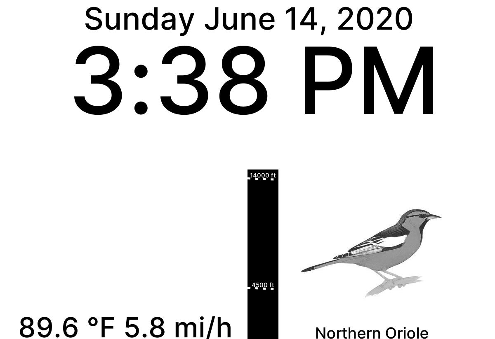

# eink-clock

A clock for e-ink displays like that in the [Kindle DX Graphite](https://en.wikipedia.org/wiki/Amazon_Kindle#Kindle_DX_Graphite).



## Setup

### Physical requirements

* Raspberry Pi Zero W or other ARM device of your choice with networking capabilities
* [jailbroken Kindle](https://wiki.mobileread.com/wiki/Kindle_Hacks_Information#Jail_break_JB) with usbnetwork

### Software

#### Prerequisites

* [Rust Language](https://www.rust-lang.org/learn/get-started) and [Cargo package manager](https://doc.rust-lang.org/cargo/index.html)

#### Building

##### Install directly on an ARM device (easier but takes longer)

First get the necessary dependencies

###### ArchLinux
```bash
pacman -S cairo openssl
```

Now build.
```bash
# May take a long time
cargo build --release
```

##### Build on your computer (cross-compile, harder but takes less time)

###### ArchLinux

Get the cross-compile toolchain: [arm-linux-gnueabihf-gcc](https://aur.archlinux.org/packages/arm-linux-gnueabihf-gcc/).
If you have yay or other makepkg utilities, you will have to install it manually.

Build
```bash
PKG_CONFIG_SYSROOT_DIR=/usr/arm-linux-gnueabihf/ PKG_CONFIG_ALLOW_CROSS=1 cargo build --release --target arm-unknown-linux-gnueabihf
```

#### Configuration

Check the parameters in `src/main.rs` and tailor them to your situation. Reach out to me if you have questions.

#### Deploying

If you cross-compiled, transfer the project folder to the device.

##### Set up Kindle networking

To network with a Kindle that has usbnetwork enabled and shows up as usb0 in `ip addr`:

###### Automatically

`eink-clock` will automatically check the network setup every time it's run.

###### Manually

Not needed, but this is essentially what `eink-clock` does.

```bash
ip a add 192.168.2.1/24 dev usb0
ip link set dev usb0 up
```

If you are connecting multiple Kindles, you'll need to change the usbnetwork config to assign unique MAC addresses and unique IP addresses.

Now, the device can network with the Kindle.

On the Kindle, make sure you've enabled auto-start for usbnetwork just in case the Kindle loses power:

```bash
ssh root@192.168.2.2
ls /mnt/us/usbnet/
# If there is a DISABLED_auto file, rename it to auto
# Beware that this means networking will always be enabled at startup
# You cannot connect the Kindle as a USB storage device again until you rename auto to DISABLED_auto
mv /mnt/us/usbnet/DISABLED_auto /mnt/us/usbnet/auto
```

##### Set up systemd service file

This needed to run eink-clock at startup

```bash
ln -s /root/eink-clock/eink-clock.service /etc/systemd/system/
systemctl enable eink-clock.service
systemctl start eink-clock.service
```

And that's it, the clock should now be running! Feel free to [contact me](https://purisa.me/about/) if you have problems.

## Special Thanks

* [David Allen Sibley](https://en.wikipedia.org/wiki/David_Allen_Sibley) for his beautiful drawings of North American birds.
